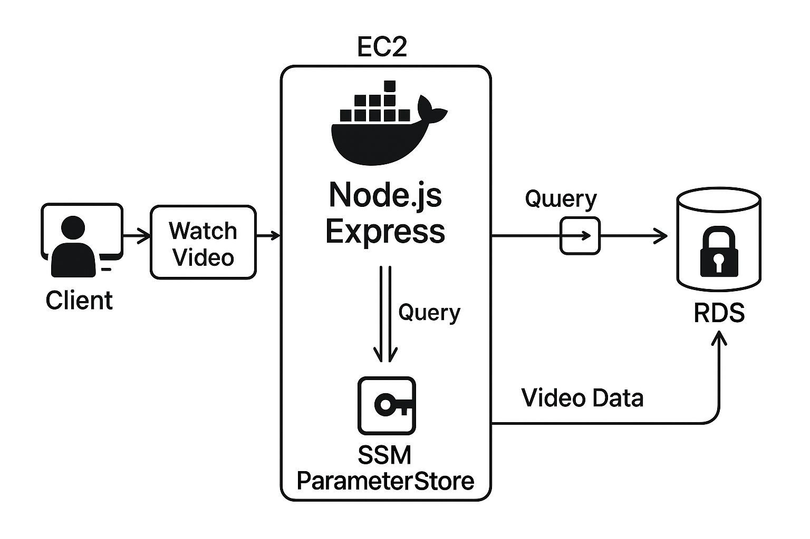

# Server Module – Cloud-Ready REST API

## 📌 Project Overview

A backend service for managing cloud-based data interactions. Built with Node.js, Express, and PostgreSQL, it offers a RESTful API to handle database operations efficiently. The project is containerized using Docker and supports automated deployment using GitHub Actions CI/CD workflows.

## 🚀 Features

* RESTful API with Express
* PostgreSQL integration
* Dockerized for consistent deployment
* CI/CD pipeline with GitHub Actions

## 🛠️ Tech Stack

* **Node.js** – JavaScript runtime
* **Express.js** – Web framework
* **PostgreSQL** – Relational database
* **Docker** – Containerization
* **GitHub Actions** – Continuous Integration/Deployment

## 📁 Project Structure

```
server-cloud-Module/
├── .github/
│   └── workflows/
│       └── server.yaml            # GitHub Actions workflow for CI/CD
├── server/
│   ├── package.json               # Node.js dependencies
│   ├── src/
│   │   ├── end-points/            # Logic for handling API requests
│   │   ├── routes/                # Express route definitions
│   │   ├── database/              # DB connection and queries
│   │   └── index.js               # App entry point
├── Dockerfile                     # Docker build configuration

```

## ⚙️ Installation

1. **Clone the repository:**

   ```bash
   git clone https://github.com/Abubakar-Meigag/server-cloud-Module.git
   cd server-cloud-Module/server
   ```

2. **Set up environment variables:**

   Create a `.env` file in the `server` directory with the following content:

   ```env
   DB_HOST=localhost
   DB_PORT=5432
   DB_USER=your_db_user
   DB_PASSWORD=your_db_password
   DB_NAME=your_db_name
   ```

3. **Install dependencies:**

   ```bash
   npm install
   ```

4. **Run the application:**

   ```bash
   npm start
   ```

   The server will start on `http://localhost:6006`.

## 🐳 Docker Setup

Ensure you have Docker and Docker Compose installed.

1. **Build and run containers:**

   ```bash
   docker-compose up --build
   ```

   This will start both the Node.js server and the PostgreSQL database.

2. **Access the application:**

   The server will be accessible at `http://localhost:6006`.

## 🔄 GitHub Actions CI/CD

The project includes a GitHub Actions workflow located at `.github/workflows/server.yaml` that automates:

* Installing dependencies
* Running tests
* Building the Docker image
* Deploying to your chosen platform in AWS EC2

## 📬 API Endpoints

* `GET /api/videos` – Retrieve all videos
* `GET /api/videos/:id` – Retrieve an video by ID
* `POST /api/videos` – Create a new video
* `DELETE /api/videos/:id` – Delete an video

Here’s a detailed explanation of your **CI/CD workflow** from the `server.yaml` file, written in the structured style you requested:

---

## 🚀 CI/CD Workflow Overview: `server.yaml`

This GitHub Actions workflow automates the secure deployment of your Node.js + PostgreSQL backend to an AWS EC2 instance. It handles the full CI/CD pipeline—from fetching the code, configuring access, and pulling secrets from AWS, to rebuilding and restarting Docker containers.

---

## 📋 Workflow Details

### 🔔 **Trigger**

The workflow is triggered on every `push` to the `main` branch:

```yaml
on:
  push:
    branches:
      - main
```

---

## 🛠️ **Job: deploy**

### 🔧 Runs on:

```yaml
runs-on: ubuntu-latest
```

The job runs on the latest version of Ubuntu provided by GitHub Actions runners.

---

### 🧩 **Steps**

---

#### 1. **Checkout Code**

```yaml
- uses: actions/checkout@v2
```

Clones your repository so the GitHub Actions runner can access and work with your project files.

---

#### 2. **Set up Node.js**

```yaml
- uses: actions/setup-node@v2
  with:
    node-version: '23'
```

Installs Node.js version 23 to ensure your application and tools (e.g. Docker build scripts) run in the correct environment.

---

#### 3. **Setup SSH Key**

```yaml
- uses: webfactory/ssh-agent@v0.9.0
  with:
    ssh-private-key: ${{ secrets.EC2_SSH_KEY }}
```

This loads your private SSH key (stored securely in GitHub Secrets) so the runner can establish an SSH connection with your EC2 instance.

---

#### 4. **Get GitHub Runner Public IP**

```yaml
- name: Get GitHub Runner IP
  id: get_ip
  run: echo "GITHUB_RUNNER_IP=$(curl -s https://api.ipify.org)" >> $GITHUB_ENV
```

Retrieves the public IP address of the GitHub Actions runner and stores it as an environment variable (`GITHUB_RUNNER_IP`).

---

#### 5. **Allow GitHub Runner IP on EC2 SG**

```yaml
- name: Allow GitHub Runner IP on EC2 SG
  run: |
    aws ec2 authorize-security-group-ingress \
      --group-id ${{secrets.SECURITY_GROUP_ID}} \
      --protocol tcp \
      --port 22 \
      --cidr ${{ env.GITHUB_RUNNER_IP }}/32
```

Temporarily opens **port 22 (SSH)** in the EC2 **Security Group** to allow this GitHub runner's IP to connect to the EC2 instance.
✅ This is essential because GitHub runners use dynamic IPs, and EC2 normally blocks unknown addresses by default.

---

#### 6. **Deploy Manually via SSH**

```yaml
- name: Deploy manually via SSH
  run: |
    ssh -o StrictHostKeyChecking=no ec2-user@${{ secrets.EC2_PUBLIC_IP }} << 'EOF'
      ...
    EOF
```

### ✅ What Happens During Deployment:

* **Git Safe Directory**: Ensures `/opt/ansible` is considered safe by Git.
* **Navigate to Project**: Moves into the correct directory on the EC2 instance.
* **Pull Latest Code**: Pulls the latest code from GitHub.
* **Get DB URL**: Uses AWS Systems Manager Parameter Store to retrieve the `DB_URL` secret securely.
* **Stop Old Container**: Stops and removes the running Docker container (if any).
* **Build Image**: Rebuilds the Docker image from scratch (no cache).
* **Run Container**: Launches the new Docker container with the injected `DB_URL`.

---

#### 7. **Revoke GitHub Runner IP from EC2 SG**

```yaml
- name: Remove GitHub Runner IP from EC2 SG
  if: always()
  run: |
    aws ec2 revoke-security-group-ingress \
      --group-id ${{ secrets.SECURITY_GROUP_ID }} \
      --protocol tcp \
      --port 22 \
      --cidr ${{ env.GITHUB_RUNNER_IP }}/32
```

❌ Removes the temporary SSH access for the GitHub runner IP after deployment is complete, whether it succeeds or fails. This step is crucial for maintaining EC2 instance security.

---

## ✅ Summary

This workflow provides:

* Secure and temporary access to your EC2 server
* Fully automated deployment using Docker
* Encrypted retrieval of environment variables from AWS SSM
* Auto-cleanup of firewall rules post-deployment

---

### 📊 CI/CD Deployment Flow Diagram

```plaintext
+---------------------+           +-------------------------+
|  Developer pushes   |  PUSH     |  GitHub Actions Runner  |
|  code to `main`     +---------->+ (Ubuntu, Dynamic IP)    |
+---------------------+           +-------------------------+
                                          |
                                          | 1. Checkout Code
                                          | 2. Setup Node.js
                                          | 3. Setup SSH
                                          | 4. Get Runner IP
                                          |
                                          v
                                +------------------------------+
                                | AWS EC2 Security Group (SG)  |
                                | Open port 22 for Runner IP   |
                                +--------------+---------------+
                                               |
                                               v
                           +-----------------------------------------+
                           | GitHub Runner connects to EC2 via SSH  |
                           | (using temporary SG rule)              |
                           +----------------+------------------------+
                                            |
                     +----------------------+----------------------------+
                     | Inside EC2 instance:                             |
                     |                                                  |
                     | - Pull latest code                               |
                     | - Retrieve DB_URL from AWS SSM                   |
                     | - Stop/remove old Docker container               |
                     | - Build new Docker image                         |
                     | - Run new container with env vars                |
                     +--------------------------------------------------+
                                            |
                                            v
                        +-----------------------------------------+
                        | GitHub Runner revokes its SSH access   |
                        | by removing IP from EC2 Security Group |
                        +-----------------------------------------+
```



